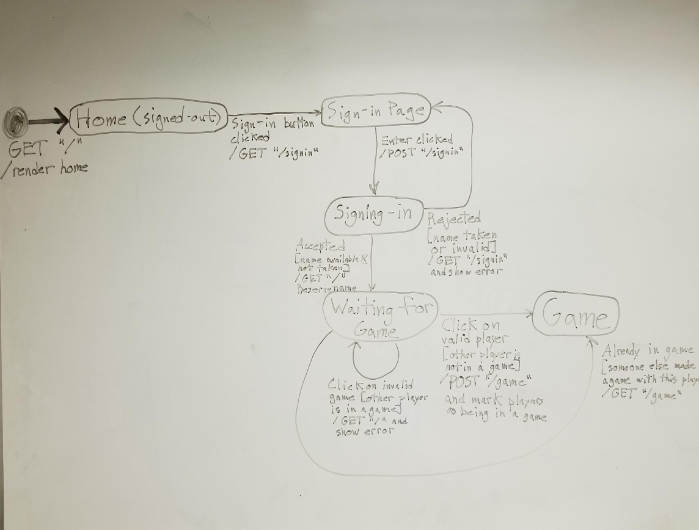
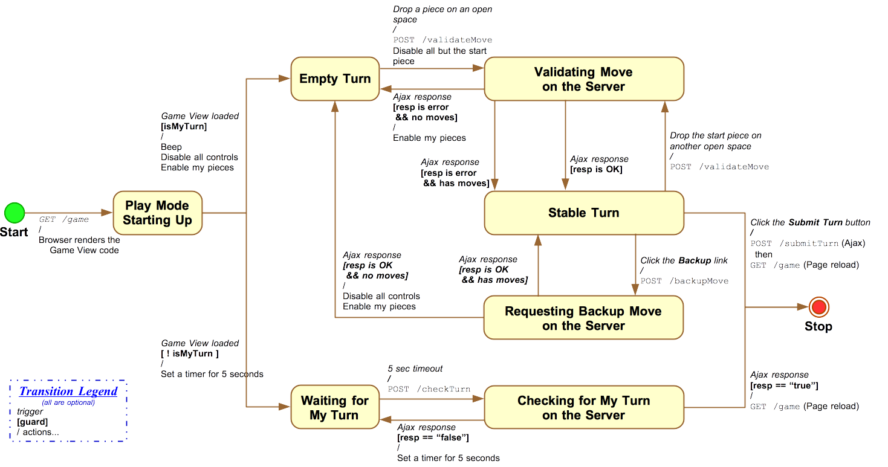
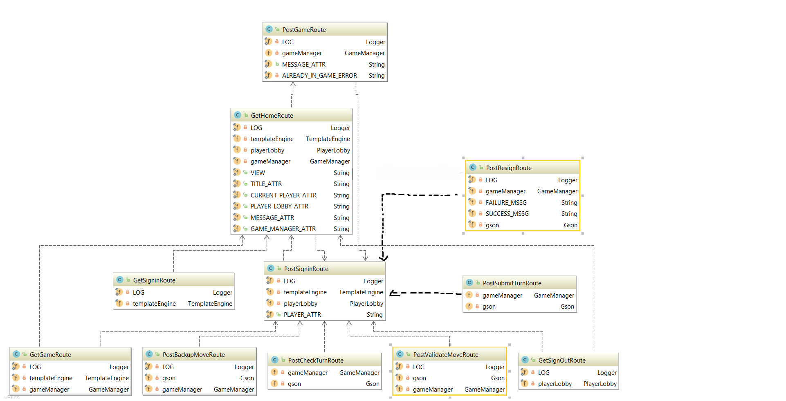
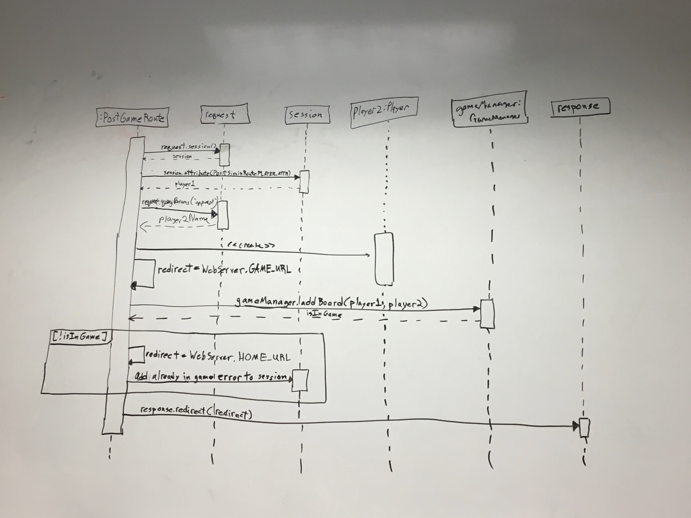
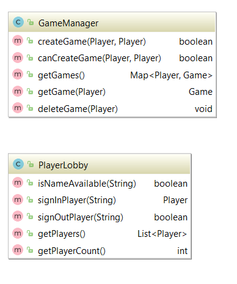
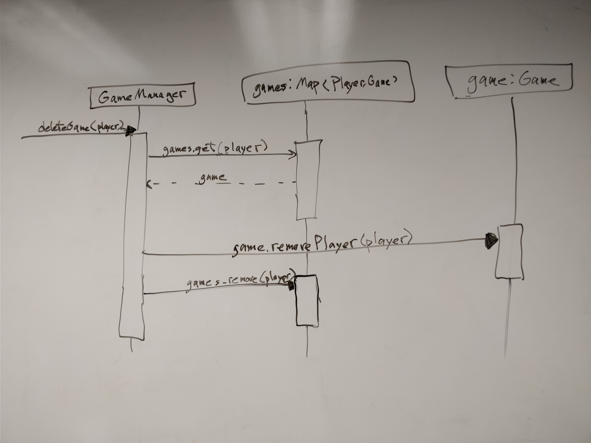
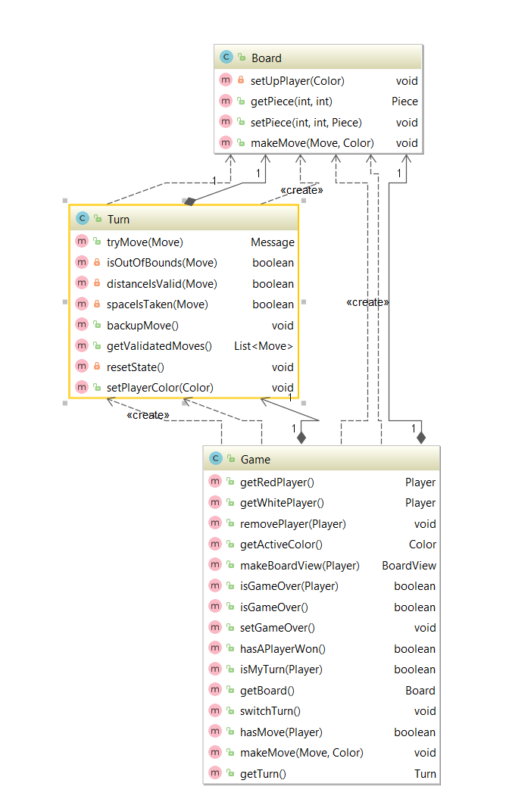
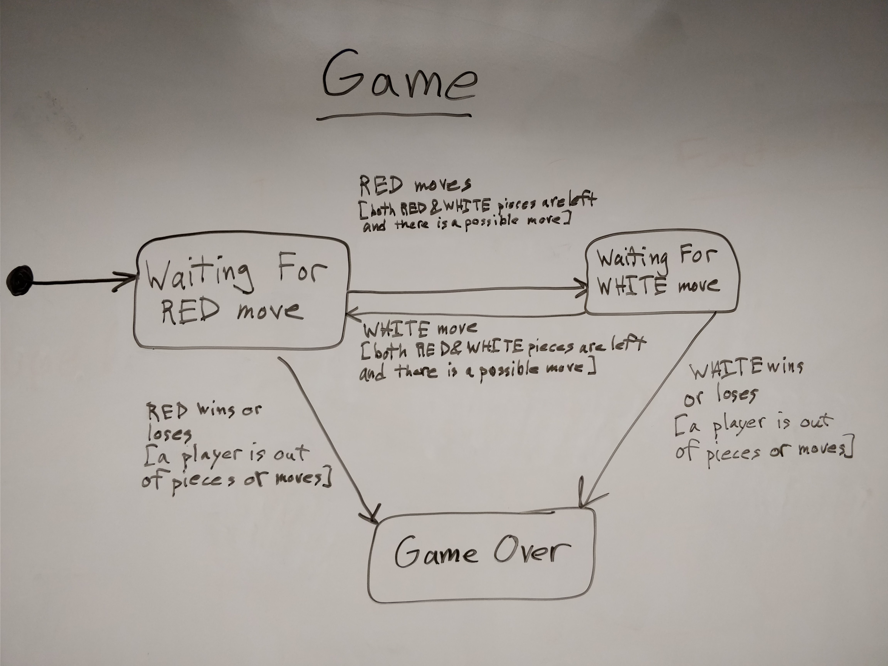

# Web Checkers Design Documentation

# Team Information
* Team name: 2175-swen-261-13-b-checker-masters
* Team members
  * Mark Drobnak
  * Sam Davis
  * Karl Coelho
  * Jacob Keegan
  * Jorge Leyva

## Executive Summary

The application must allow players to play checkers with other players who are currently signed-in. The game user interface (UI) will support a game experience using drag-and-drop browser capabilities for making moves. Beyond this minimal set of features, we have grand vision for how we could further enhance on the player experience with some additional features beyond the basic checkers game.

### Purpose

The most important user group is players who are interested in playing checkers, online, with other players. Players should be able to play games with other players who have signed in to the game, they should be able to leave any game they are currently playing, and they should be able to actually play a game of checkers.

### Glossary and Acronyms
> Provide a table of terms and acronyms.

| Term | Definition |
|------|------------|
| VO | Value Object |

## Requirements

This section describes the features of the application.

> In this section you do not need to be exhaustive and list every story.  Focus on top-level features from the Vision document and maybe Epics and critical Stories.

### Definition of MVP
Every player must sign-in before playing a game, and be able to sign-out when finished playing
Two players must be able to play a game of checkers based upon the American rules
Either  player of a game may choose to resign, at any point, which ends the game

### MVP Features
- (User Story) Player Sign-in
- (User Story) Start a Game
- (User Story) Player Sign-out
- (User Story) Matchmaking
- (User Story) Game Requests
- (User Story) Game Over
- (User Story) Forfeiting
- (User Story) Valid Moves
- (User Story) Player Turns
- (User Story) Jumps
- (User Story) Player Help
- (Epic) Kings
- (User Story) Storing Replays
- (User Story) Listing Replays

### Roadmap of Enhancements
- Make sure that the Player can Sign-out 
- Make sure that the Game can actually be declared over
- Make sure players can forfeit from a game
- Make sure that Game requests can be sent to other players
- Make sure that the players are allowed to only make valid moves
- Allow users to request help from the Game view
- Allow users to see replays of their past games

## Application Domain

This section describes the application domain.

There are several important entities for this web app, including the Player entities, the Piece entities, the Board entities, which all interact with each other. The Player entity is used to represent a Player in the game, who has control over the Piece entities, which are placed on the Board entity.  Other important entities are the Game entity, which holds all of the other entities, and the Board entity, which holds the board information. Players are able to make Game Requests to other players, and the player is able to manipulate the Piece entities using Moves.

## Architecture

This section describes the application architecture.

### Summary

The following Tiers/Layers model shows a high-level view of the webapp's architecture.

As a web application, the user interacts with the system using a browser.  The client-side
of the UI is composed of HTML pages with some minimal CSS for styling the page.  There is also
some JavaScript that has been provided to the team by the architect.

The server-side tiers include the UI Tier that is composed of UI Controllers and Views.
Controllers are built using the Spark framework and View are built using the FreeMarker framework.  The Application and Model tiers are built using plain-old Java objects (POJOs).

Details of the components within these tiers are supplied below

### Overview of User Interface

This section describes the web interface flow; this is how the user views and interacts
with the WebCheckers application.

A user will first see a Home page with a button indicating a sign in link, which moves the user to the Sign-in page, which will allow the user to type in their name, and sign-in to the game.  Depending on the name used, the sign-in request will be rejected, bringing them back to the Sign-in page, or if it is accepted, then it will take them to the Game-wait page, where they will wait for a game. If the user clicks on an invalid game, they will be sent back to the Game-wait page, else, they will be sent to the Game page, where a game will commence.

First, the board will be generated for each player. Then, the first player will make their moves(s) while the second player can do nothing. If a move is validated, the piece is changed to be in that place. The Backup button can be used at any time to reverse a validated move. One the first player has made a validated move or moves, they click submit turn, the changes appear to the second player, and they take their turn.

### UI Tier
The Server-side UI tier of the architecture is responsible for responding to the input of the user, so when they click on specific buttons and links, the UI tier has to make sure the corresponding button press will take the user to the corresponding page.

For example, the BoardView component of the UI tier is responsible for showing the game’s board, and to update it whenever moves are made.  The different Get routes are used to bring the user to the various pages, such as the Sign-in page, while the Post routes are used to get the page information from the user and update the pages accordingly.

Many Routes rely on PostSignInRoute for its static PLAYER_ATTR, or for redirecting.

#### Static model

#### Dynamic model

### Application Tier
The Application tier of the architecture is the one responsible for keeping track of the information used by the application, such as the games that the application is currently hosting, and the players that are currently signed in.

The GameManager component of the Application tier is tasked with monitoring the different games that are currently underway. The PlayerLobby component is tasked with monitoring the amount of players that are currently signed into the game and also makes sure that all of the names in the lobby are unique.

#### Static model

#### Dynamic model

### Model Tier
The Model tier of the architecture is responsible for holding the data that has to do with the actual games being played in the application, so anything to do with the Player entities, Boards and Pieces

The different components of the Model tier such as the Board, Piece and Player all represent their namesakes, so the Board represents the board of the game, which holds the different Player’s pieces, the Pieces are the moveable components of the game, which are manipulated by the Player.

#### Static model

#### Dynamic model

