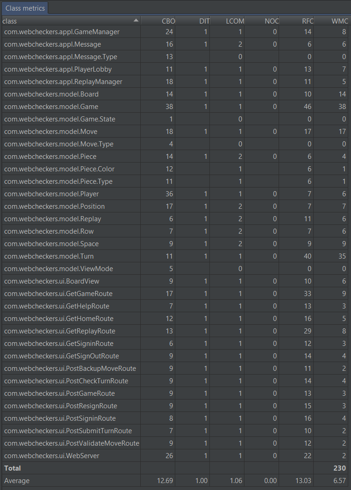

# Web Checkers Design Documentation

# Team Information
* Team name: 2175-swen-261-13-b-checker-masters
* Team members
  * Mark Drobnak
  * Sam Davis
  * Karl Coelho
  * Jacob Keegan
  * Jorge Leyva

## Executive Summary

The application must allow players to play checkers with other players who are
currently signed-in. The game user interface (UI) will support a game experience
using drag-and-drop browser capabilities for making moves. Beyond this minimal
set of features, we have grand vision for how we could further enhance on the
player experience with some additional features beyond the basic checkers game.

### Purpose

The most important user group is players who are interested in playing checkers, 
online, with other players. Players should be able to play games with other 
players who have signed in to the game, they should be able to leave any game 
they are currently playing, and they should be able to actually play a game of 
checkers.

### Glossary and Acronyms
| Term | Definition |
|------|------------|
| VO | Value Object |

## Requirements

This section describes the features of the application.

### Definition of MVP
Every player must sign-in before playing a game, and be able to sign-out when 
finished playing. Two players must be able to play a game of checkers based 
upon the American rules. Either player of a game may choose to resign, at any 
point, which ends the game.

### MVP Features
- (User Story) Player Sign-in
- (User Story) Start a Game
- (User Story) Player Sign-out
- (User Story) Matchmaking
- (User Story) Game Requests
- (User Story) Game Over
- (User Story) Forfeiting
- (User Story) Valid Moves
- (User Story) Player Turns
- (User Story) Jumps
- (User Story) Player Help
- (Epic) Kings
- (User Story) Storing Replays
- (User Story) Listing Replays
- (User Story) Viewing Replays
- (User Story) Forced Moves

### Roadmap of Enhancements
- Make sure that the Player can Sign-out 
- Make sure that the Game can actually be declared over
- Make sure players can forfeit from a game
- Make sure that Game requests can be sent to other players
- Make sure that the players are allowed to only make valid moves
- Allow users to request help from the Game view
- Allow users to see replays of their past games

## Application Domain

This section describes the application domain.

There are several important entities for this web app, including the Player
entities, the Piece entities, and the Board entities which all interact with 
each other. The Player entity is used to represent a Player in the game, who
has control over the Piece entities, which are placed on the Board entity. Other
important entities are the Game entity, which holds all of the other entities, 
and the Board entity, which holds the board information. Players are able to 
make Turns to apply to the board, which the are created when the player moves
Piece entities on the displayed Board.

## Architecture

This section describes the application architecture.

### Summary

The following Tiers/Layers model shows a high-level view of the webapp's 
architecture.

As a web application, the user interacts with the system using a browser.
The client-side of the UI is composed of HTML pages with some minimal CSS for 
styling the page.  There is also some JavaScript that has been provided to the 
team by the architect.

The server-side tiers include the UI Tier that is composed of UI Controllers
and Views. Controllers are built using the Spark framework and View are built 
using the FreeMarker framework.  The Application and Model tiers are built 
using plain-old Java objects (POJOs).

Details of the components within these tiers are supplied below

### Overview of User Interface

This section describes the web interface flow; this is how the user views and 
interacts with the WebCheckers application.

This state diagram describes the high level flow of the web interface. The 
"In Game" state contains the following subsystem.

### UI Tier
The Server-side UI tier of the architecture is responsible for responding to the
input of the user, so when they click on specific buttons and links, the UI tier 
has to make sure the corresponding button press will take the user to the 
corresponding page.

For example, the BoardView component of the UI tier is responsible for showing 
the game’s board, and to update it whenever moves are made.  The different Get 
routes are used to bring the user to the various pages, such as the Sign-in 
page, while the Post routes are used to get the page information from the user 
and update the pages accordingly.

#### Static model

#### Dynamic model

### Application Tier
The Application tier of the architecture is the one responsible for keeping 
track of the information used by the application, such as the games that the 
application is currently hosting, and the players that are currently signed in.

The GameManager component of the Application tier is tasked with monitoring the 
different games that are currently underway. The PlayerLobby component is 
tasked with monitoring the amount of players that are currently signed into the 
game and also makes sure that all of the names in the lobby are unique.

#### Static model

#### Dynamic model

### Model Tier
The Model tier of the architecture is responsible for holding the data that has 
to do with the actual games being played in the application, so anything to do 
with the Player entities, Boards and Pieces

The different components of the Model tier such as the Board, Piece and Player 
all represent their namesakes, so the Board represents the board of the game, 
which holds the different Player’s pieces, the Pieces are the moveable 
components of the game, which are manipulated by the Player.

#### Static model

#### Dynamic model

### Code Metric Analysis

#### Chidamber-Kemerer 
  
With an average DIT (depth of inheritance tree) of 1 and an average LCOM (lack 
of cohesion of methods) of 1.06, our project does not lack cohesion of methods 
nor does it have needlessly complex inheritance. In fact our average NOC 
(number of children) of 0.00 tells us that we did not make use of any inheritance 
in our project. We see this as a benefit as the vision statement seemed to have
no need for inheritance. Our WMC (weighted methods per class) and CBO (coupling
between object classes) averages are good but when individually looking at classes
highlight room for improvement in many classes. With a CBO average of 12.69, and
a recommended maximum CBO of 14, we could benefit from coupling improvement. 
With some of the highest coupling classes including Game (38), Player (36), 
GameManager(24) and  Move (18) we did not see a way to reduce coupling without 
having other major setbacks in other complexity areas. Our WMC average is 6.57, 
which is great overall. However two classes in particular stand out as having 
WMC of far too high. Most of our classes fall between 0-10 weighted methods 
while Game has 38 and Turn has 35. These are classes that could benefit from 
splitting work into multiple sub-classes.

[source](http://www.aivosto.com/project/help/pm-oo-ck.html)

#### Cyclomatic Complexity
  
The cyclomatic complexity of our project is good. The analysis may suggest that 
our GetGameRoute, GetReplayRoute and Turn classes are overly complex. We argue 
that due to the nature of checkers turns it is unavoidable to have classes that 
deal with the outcome of move turns that do not have a higher level of cyclomatic 
complexity. The poor WMC metrics of Turn and Game are highlighted in 
Chidamber-Kemerer analysis.

#### Javadoc Coverage
  
The javadoc coverage metric highlights an area in need of drastic improvement. 
The field coverage has an average of 0.78% across all classes in the project. 
The method coverage has an average of only 61.1% across all methods. The average 
number of lines of javadoc comments per class is 13.94. This shows an extreme 
lapse in documentation across our whole project. We recommend making a story 
to javadoc all methods and fields within every production class, and ideally 
all test classes. It is an easy task that greatly improves readability and 
maintainability.

#### Lines of Code
  
This metric does not tell us too much except that our model and ui tiers have
much more code than our application tier. This generally tells us that these 
tiers are more complex. Fewer lines is often better but we do not see a need to 
greatly reduce our line count anywhere in our project. 

#### Martin Package Metric
  
Our average abstractness is 0.11 with none of the tiers (ui, model and application) 
having any layers of abstraction. This signifies that our project is completely 
concrete. Our average instability of classes has an average of 0.70. This shows 
a weakness in our project that signifies that our project is nearer to completely 
unstable and that it has no resilience to change. Our afferent coupling and efferent 
coupling averages are 19.00 and 34.25 respectively. We feel that these are respectable 
numbers as our project has lots of intermingling between the different tiers, but in 
order to improve upon the instability, the coupling needs to be decreased. Finally 
the average distance from the main sequence is 0.36. This is also a good number 
indicating that our project is fairly close to the main sequence.

#### Object Oriented Design Principles

Single Responsibility Principle:
    Our design holds very closely to this principle. The only possible exceptions,
    as mentioned above, are Turn and Game. Turn's responsibility could be described as:
    manage data related to a Turn, including validating moves. So, validating moves
    could be factored out to create a tighter responsibility. While metrics showed Game
    to be complex, this is probably unavoidable due to the nature of WebCheckers.
    It simply must have a Turn, a State, two players, and a Board (and all the
    methods this entails).
    
Dependency Inversion/Polymorphism:
    As mentioned above, we made no abstractions/use of polymorphism. While we
    certainly could have, it seems unnecessary for a project as specific as this.
    But the topic of dependency injection specifically is different.
    Most classes feature dependency injection. Notable exceptions are Replay and Turn.
    Move cannot have the type of Move injected, as this is determined by methods in Move.
    Game cannot have several things injected, as the rules of checkers need to be followed.
    For example, if you could inject submittedMoves, you could add moves that aren't valid.
    
Low Cohesion/Law of Demeter:
    An analysis of UML dependencies show that our system has quite low coupling. For example,
    UI interaction is only used when completely necessary. GetReplayRoute and GetHomeRoute
    have to access ReplayManager no matter what, for example. Removing the omnipresent
    classes and Player class, most UI classes become decoupled from the Model tier altogether.
    Notable exceptions to this are GetGameRoute and GetReplayRoute. However, this is mainly
    due to the restrictions of what was given to us. Within the Model tier, once constant
    references to the board size are ignored, coupling is again very low.
    
GRASP Controller:
    As stated above, nearly everything in the UI-tier "outsources" any system operations that
    need to be performed.
    
Pure Fabrication:
    Several classes were purely fabricated for this project. Beyond the required (and
    therefore not noteworthy) classes, we made ReplayManager, GameManager, and Turn.
    The former 2 are simply encapsulations of a Map, from Player to Replays or a Game.
    This is far more cohesive than just putting those maps everywhere. Meanwhile, Turn
    encapsulates logic that WebCheckers requires, but would not be thought about when
    playing checkers. For example, your opponent may tell you that a move is invalid in
    real life, and you may remove jumped pieces and/or take your finger off of your moved
    piece to signify the end of your turn. Obviously, this cannot work in an online format,
    so Pure Fabrication was needed.
    
## Sprint 3 Changes
    The only significant changes made during Sprint 3 was the addition of dependency injection
    nearly everywhere, and the simplification of logic in both the Game and Turn classes.
